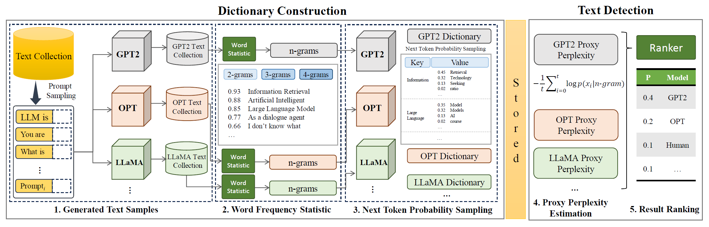

# 🪬 LLMDet：A Third Party Large Language Models Generated Text Detection Tool | [Paper](https://arxiv.org/abs/2305.15004)

LLMDet is a text detection tool that can identify which generated sources the text came from (e.g. large language model or human-write). The core idea of the detection algorithm is to use the n-grams probability sampled from specified language model to calculate proxy perplexity of large language models, and use the proxy perplexity as a feature to train a text classifier.

### Features
We believe that a practical LLM detection tool needs to have the following capabilities, which is also the goal of our LLMDet.

1. **Specificity**: Our project aims to distinguish between different large language models and human-generated text. For example, LLMDet can tell you whether the text is generated by GPT-2 or OPT or a human, and give each a specific probability.
2. **Safty**: Our project does not need to require running large language models locally. That is, we can act as a third-party authentication agent without maintaining large language models, which may be fixed assets or sensitive information for large companies.
3. **Efficiency**: Our method detects very fast. This is because we don't need to infer from large language models.
4. **Extendibility**: Our project can easily adapt to newly proposed large language models.

### Framework



The detailed processes of the proposed tool LLMDet. It contains two main phases, dictionary construction and text detection. The dictionary construction phase is carried out offline by us or provided by the model holder,  independent of external systems. The text detection phase can be accessed by the tool user who, as a third party, performs text detection without holding the model.

### Installation Notes
A package for large language model-generated text detection tool.

Before you go ahead with the installation of this toolkit, please execute the following command to make sure that the version of transformers >= 4.29.0.
```shell
pip install git+https://github.com/Liadrinz/transformers-unilm
pip install git+https://github.com/huggingface/transformers
```

Code is compatible with Python >=3.8
  * Fully automatic installation: `pip install llmdet`
  * Semi-automatic installation: First download http://pypi.python.org/pypi/llmdet/ , decompress and run `python setup.py install`
  * See `requirements.txt` for dependent python packages.

### Main Functions
Currently, LLMDet offers two functions:

1. **Detection**: It is supported to determine whether the given text comes from GPT-2, LLaMA, BART, OPT, UniLM, T5, Bloom, GPT-neo, or Human-write.
2. **Extendibility**: It allows model owners to extend the detection capability of LLMDet to novel models.

#### Examples
```python
import llmdet

llmdet.load_probability()

text = "The actress was honoured for her role in 'The Reader' at the annual ceremony, which was held at the Royal Albert Hall. The film, which is based on the novel by the same name by Philip Roth, tells the story of a New York Times reporter who returns to his hometown to cover the death of his brother-in-law. Winslet plays his wife, with whom he has been divided since the death of their son.\nIn the film, Winslet plays the mother of the grieving brother-in-law.\nThe actress also won a Golden Globe for her role in the film at the ceremony in November.\nWinslet was also nominated for an Oscar for her role in 'The Reader'.\nThe 63-year-old Winslet was seen accepting her awards at the ceremony, where she was joined by her husband, John Krasinski, who has been nominated for best supporting actor in the film.\nWinslet and Krasinski met while"

# Detect, `text` is a string or string list
result = llmdet.detect(text)
print(result)
```
#### Detection Results
```json
[{
    "OPT": 0.5451331013247862,
    "GPT-2": 0.4393605735865629, 
    "UniLM": 0.012642800848279893, 
    "T5": 0.0022592730436008556, 
    "Bloom": 0.00025873253035729044, 
    "GPT-neo": 0.0002520776780109571, 
    "LLaMA": 6.0459794454546154e-05, 
    "Human_write": 1.9576671778802474e-05, 
    "BART": 1.3404522168622544e-05
}]
```
### TODO List
  - [ ] Improve the algorithm performance and efficiency.

### [The Generated-Text Detection Tool of Chinese LLMs](https://github.com/thulx18/Detect_Texts_of_CN_LLMs)
Provided by thulx18.


### Citation
If you use LLMDet in your research, please use the following BibTex entry.
```bibtex
@inproceedings{wu-etal-2023-llmdet,
    title = "{LLMD}et: A Third Party Large Language Models Generated Text Detection Tool",
    author = "Wu, Kangxi  and
      Pang, Liang  and
      Shen, Huawei  and
      Cheng, Xueqi  and
      Chua, Tat-Seng",
    editor = "Bouamor, Houda  and
      Pino, Juan  and
      Bali, Kalika",
    booktitle = "Findings of the Association for Computational Linguistics: EMNLP 2023",
    month = dec,
    year = "2023",
    address = "Singapore",
    publisher = "Association for Computational Linguistics",
    url = "https://aclanthology.org/2023.findings-emnlp.139",
    pages = "2113--2133",
}
```


